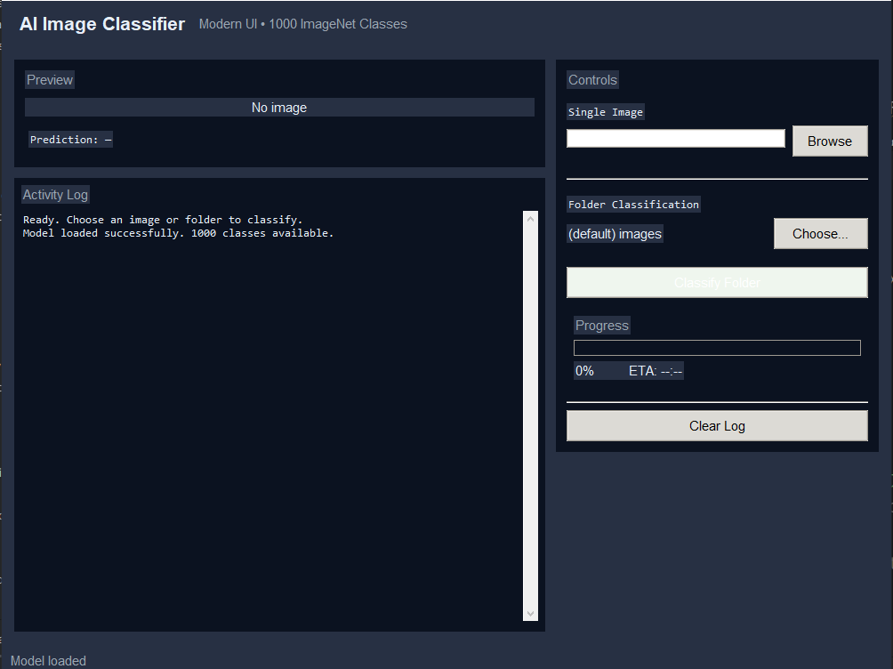

# AI Image Classifier 🧠🖼️

A desktop **AI image classifier** built with Python, PyTorch (ResNet-18), and Tkinter.  
It classifies images into **1,000 ImageNet categories** using a modern graphical interface.

---

## 📸 Screenshot

---

## 🛠 Features

- 🖼️ Single image classification
- 📁 Full folder batch classification
- 🧠 Top-5 predictions with confidence scores
- 🔍 Live image preview
- 📊 Progress tracking system
- ⚡ Powered by pretrained ResNet-18 (ImageNet)

---

## 🚀 How to Run

### 1. Clone the repository

git clone https://github.com/your-username/ai-image-classifier.git
cd ai-image-classifier

### 2. Install dependencies

pip install torch torchvision Pillow

### 3. Run the application

python ImagesClassification_GUI_Final.py

---

## 📝 Usage

- Launch the app
- Select an image or folder
- View predicted classes with confidence scores
- Check top-5 model predictions

---

## 📦 File Structure

ai-image-classifier/
├── ImagesClassification_GUI_Final.py
├── README.md
├── assets/
│   └── image-classifier.png
└── models/   # optional cached model data

---

## ⚙️ How It Works

1. Loads pretrained ResNet-18 (ImageNet weights)
2. Preprocesses input image (resize, normalize)
3. Runs inference through neural network
4. Returns top-5 predicted classes
5. Displays results in Tkinter UI

---

## ⚡ Future Improvements

- Add class label search/filter
- Export prediction history
- Drag & drop support
- Dark/light theme toggle
- Web version (Flask / FastAPI)

---

## 💻 Technologies

- Python 3.x
- PyTorch
- Torchvision
- Tkinter
- Pillow

---

## 📧 Contact

Created by **Jimoulis31**
